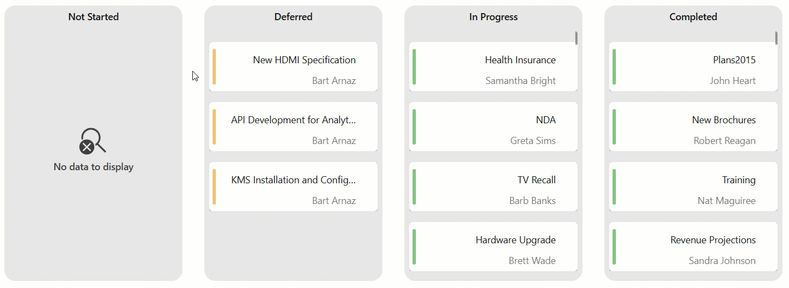

<!-- default badges list -->

[](https://supportcenter.devexpress.com/ticket/details/T1312597)
[](https://docs.devexpress.com/GeneralInformation/403183)
[](#does-this-example-address-your-development-requirementsobjectives)
<!-- default badges end -->
# Blazor - Implement a Kanban Board Component with the DevExpress Blazor Grid

This example implements a Kanban Board component (`DxKanban`) using the [DevExpress Blazor Grid](https://docs.devexpress.com/Blazor/403143/components/grid). The Kanban Board UI component includes the following features/capabilities:

* Organizes cards across columns
* Allows users to reorder cards/columns via drag & drop



## Add a Kanban Board to Your Application

Follow the steps below to add a Kanban Board component to your DevExpress-powered Blazor application:

1. Copy the [DxKanban](./CS/BlazorKanban/Components/DxKanban) folder to your application's *Components* folder.

2. Copy the [kanban.css](./CS/BlazorKanban/wwwroot/css/kanban.css) stylesheet to the *wwwroot/css* folder. Register the stylesheet in the *App.razor* file:

    ```razor
    @DxResourceManager.RegisterTheme(Themes.Fluent.Clone(properties => {
        properties.AddFilePaths("css/kanban.css");
        // ...
    }))
    ```

3. Copy and register the [card-styles.css](./CS/BlazorKanban/wwwroot/css/card-styles.css) file to recreate card appearance (defined in `CardTemplate`). Skip this step if you plan to customize card layout and styling.

    ```razor
    @DxResourceManager.RegisterTheme(Themes.Fluent.Clone(properties => {
        properties.AddFilePaths("css/card-styles.css");
        // ...
    }))
    ```

4. Register the `BlazorKanban.Components.DxKanban` namespace in the *Components/Imports.razor* file.

5. Open/create a Razor page and enable interactivity.

6. Add the Kanban Board component (`DxKanban`) to the page and configure component settings (refer to the next section).

## DxKanban API Members

### Properties

- **Data**  
Specifies an [IEnumerable](https://learn.microsoft.com/en-us/dotnet/api/system.collections.generic.ienumerable-1) object that supplies Kanban Board data.

- **CardTemplate**  
Defines card appearance.

- **ColumnNameFieldName**  
Specifies a data field that identifies the card target column.

- **Columns**  
Allows you to add Kanban Board columns (`DxKanbanColumn`). For each column, assign an identifier to the `ColumnName` property. This identifier must match a `ColumnNameFieldName` field value.

- **CssClass**  
Allows you to customize component appearance using CSS.

### Events

- **CardDropped**

  Fires on a card drop. In the event handler, update the data source: insert the card at the drop position and remove it from the initial position.  

  For simplicity, this event uses [GridItemsDroppedEventArgs](https://docs.devexpress.com/Blazor/DevExpress.Blazor.GridItemsDroppedEventArgs).

## Implementation Details

Internally, the Kanban Board component is a [DevExpress Blazor Grid](https://docs.devexpress.com/Blazor/403143/components/grid) that displays nested Grids within columns. Each card is a nested Grid row.

Main classes include:

* [DxKanban](./CS/BlazorKanban/Components/DxKanban/DxKanban.razor)

  Creates a root-level Grid component. The Grid is bound to a fake single-row data source with multiple reorderable columns (`DxKanbanColumn`). The component uses [CascadingValue](https://learn.microsoft.com/en-us/aspnet/core/blazor/components/cascading-values-and-parameters#cascadingvalue-component) to pass Kanban Board settings to columns.

  To allow users to drag cards without a drag handle, the component executes JS code in [AfterRenderAsync](https://learn.microsoft.com/en-us/aspnet/core/blazor/components/lifecycle#after-component-render-onafterrenderasync).

* [DxKanbanColumn](./CS/BlazorKanban/Components/DxKanban/DxKanbanColumn.razor)

  Creates a [DxGridDataColumn](https://docs.devexpress.com/Blazor/DevExpress.Blazor.DxGridDataColumn) with one data cell. The data cell contains a nested Grid with cards (`DxKanbanColumnGrid`).

* [DxKanbanColumnGrid](./CS/BlazorKanban/Components/DxKanban/DxKanbanColumnGrid.razor)

  A nested Grid component that obtains Kanban Board data, filters it by column name (`DxKanban.ColumnNameFieldName`), and displays the resulting collection as cards. [DragHintTextTemplate](https://docs.devexpress.com/Blazor/DevExpress.Blazor.DxGrid.DragHintTextTemplate) and [CellDisplayTemplate](https://docs.devexpress.com/Blazor/DevExpress.Blazor.DxGridDataColumn.CellDisplayTemplate) specify card appearance.
  
  The Grid processes card drop actions using the `DxKanban.CardDropped` event handler.

## Files to Review

- [Index.razor](./CS/BlazorKanban/Components/Pages/Index.razor)
- [DxKanban.razor](./CS/BlazorKanban/Components/DxKanban/DxKanban.razor)
  - [DxKanban.razor.cs](./CS/BlazorKanban/Components/DxKanban/DxKanban.razor.cs)
  - [DxKanban.razor.js](./CS/BlazorKanban/Components/DxKanban/DxKanban.razor.js)
- [DxKanbanColumn.razor](./CS/BlazorKanban/Components/DxKanban/DxKanbanColumn.razor)
  - [DxKanbanColumn.razor.cs](./CS/BlazorKanban/Components/DxKanban/DxKanbanColumn.razor.cs)
- [DxKanbanColumnGrid.razor](./CS/BlazorKanban/Components/DxKanban/DxKanbanColumnGrid.razor)
  - [DxKanbanColumnGrid.razor.cs](./CS/BlazorKanban/Components/DxKanban/DxKanbanColumnGrid.razor.cs)
- [KanbanModel.cs](./CS/BlazorKanban/Data/KanbanModel.cs)
- [kanban.css](./CS/BlazorKanban/wwwroot/css/kanban.css)
- [card-styles.css](./CS/BlazorKanban/wwwroot/css/card-styles.css)

## Documentation

- [DevExpress Blazor Components](https://docs.devexpress.com/Blazor/400725/blazor-components)
- [Drag and Drop Rows in Blazor Grid](https://docs.devexpress.com/Blazor/405231/components/grid/drag-and-drop-rows)

## More Examples

- [Blazor - Use DevExtreme Diagram in Blazor Applications](https://github.com/DevExpress-Examples/blazor-use-devextreme-diagram)

<!-- feedback -->
## Does This Example Address Your Development Requirements/Objectives?

[](https://www.devexpress.com/support/examples/survey.xml?utm_source=github&utm_campaign=blazor-kanban-board&~~~was_helpful=yes) [](https://www.devexpress.com/support/examples/survey.xml?utm_source=github&utm_campaign=blazor-kanban-board&~~~was_helpful=no)

(you will be redirected to DevExpress.com to submit your response)
<!-- feedback end -->
